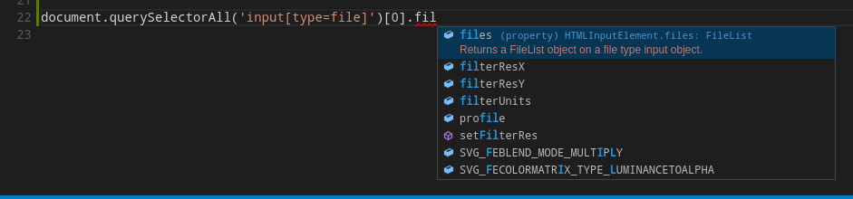

# typescript-fluent-dom

## Introduction
This project is a fork of `lib.es6.d.ts` of [typescript](https://github.com/Microsoft/TypeScript) aimed at making
DOM programming more fluent.

In this library, `querySelector()`, `getElementById()`, `getElementsByClassName()`, `children`, `firstElementChild`
etc. return `UniversalElement` or a list of `UniversalElement`, which inherits all known sub interfaces of `Element`;
`UIEvent::target` is typed as `UniversalUIEventTarget`, which extends `UniversalElement`, `Document`, and `Window`.
So in most case you don't have to cast the result before use anymore!
Additionally you don't loose the power of type check and autocompletion. Look at this snapshot:

This snapshot was taken from [Visual Studio Code](https://code.visualstudio.com/)) and demostrates autocompletion of
`HTMLInputElement::files` of the result of `querySelectorAll()`.

You can also take `test-dom.ts` as an example.

## Usage
To use this library, you can reference this `lib.es6.d.ts` file from your TS file, and pass `--noLib` to `tsc`
(or use `noLib` in [`tsconfig.json` file](https://github.com/Microsoft/TypeScript/wiki/tsconfig.json)).

## Limitations

* Some properties are typed as `any` because of type confliction.
  E.g. `HTMLInputElement::value` is `string`, but `HTMLProgressElement::value` is `number`, so
  `UniversalElement::value` becomes `any`.
  Such properties are: `x, y, width, height, href, value, rows, cols, dx, dy, method, type, target, max`.

* `getElementsByTagName(name: string)` still return `NodeList`, not `NodeListOf<UniversalElement>`
  We can't do this because specialized `getElementsByTagName()`'s return super types of `UniversalElement`.

* `SVGElement::className` is typed as `string`, but it should be `SVGAnimatedString`.
  In this library `SVGElement::className` is inherited from `Element`, so it has type `string`;
  but in reality it is always a `SVGAnimatedString`. So If you play with `className` of SVG elements via this library,
  you will get errors at runtime. You may use `set|getAttribute()` or `classList` instead. By the way,
  `SVGElement::className` is
  [deprecated in SVG2 spec](https://svgwg.org/svg2-draft/types.html#__svg__SVGElement__className),
  so you should avoid using it anyway.
